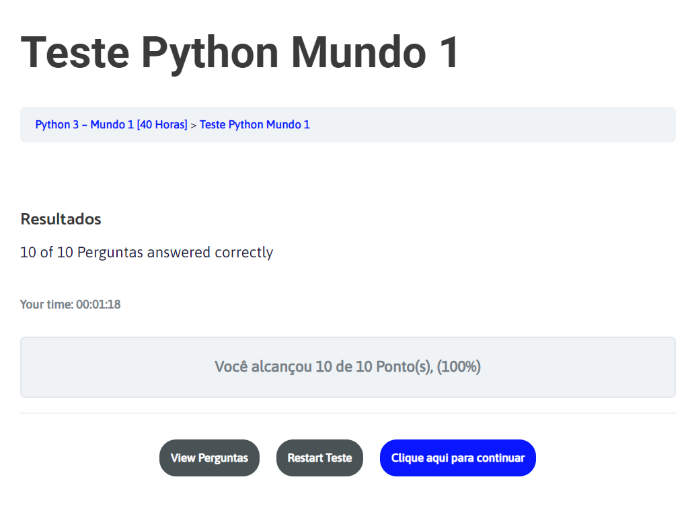

<h1>Praticando Python</h1>
<li>001 --> Escrevendo Olá mundo</li>
<li>002 --> Respondendo ao Usuário</li>
<li>003 --> Soma de dois números</li>
<li>004 --> Dissecando uma variável</li>
<li>005 --> Antecessor e Sucessor</li>
<li>006 --> Dobro, Triplo e Raiz quadrada</li>
<li>007 --> Média Aritmética</li>
<li>008 --> Conversor de medidas</li>
<li>009 --> Tabuada</li>
<li>010 --> Conversor de moedas</li>
<li>011 --> Lendo a largura e altura de uma parede em metros e canculando essa áera</li>
<li>012 --> Calculando descontos</li>
<li>013 --> Reajuste Salarial</li>
<li>014 --> Conversor de Temperaturas</li>
<li>015 --> Aluguel de carros</li>
<li>016 --> Quebrando um número</li>
<li>017 --> Catetos e Hipotenusas</li>
<li>018 --> Seno, Cosseno e Tangente</li>
<li>019 --> Sorteando um item na lista</li>
<li>020 --> Sorteando uma ordem na lista</li>
<li>021 --> Tocando um MP3</li>
<li>022 --> Analisador de Textos</li>
<li>023 --> Separando dígitos de um número</li>
<li>024 --> Verificando a primeira lista de um texto</li>
<li>025 --> Procurando uma string dentro de outra</li>
<li>026 --> Primeira e última ocorrência de uma string</li>
<li>027 --> Primeiro e último nome de uma pessoa</li>
<li>028 --> Jogo de adivinhação v.1.0</li>
<li>029 --> Radar eletrônico</li>
<li>030 --> Par ou Ímpar?</li>
<li>031 --> Custo da viagem</li>
<li>032 --> Ano Bissexto</li>
<li>033 --> Maior e menor valores</li>
<li>034 --> Aumento mútiplos</li>
<li>035 --> Analisando Triângulos</li>

  

  
  

<li>036 --> Aprovando Empréstimos</li>
<li>037 --> Conversor de Bases Numéricas</li>
<li>038 --> Comparando números</li>
<li>039 --> Alistamento Militar</li>
<li>040 --> Média Escolar Sem Peso</li>
<li>041 --> Classificando Atletas</li>
<li>042 --> Analisando Triângulos 2.0</li>
<li>043 --> Índice de massa corporal</li>
<li>044 --> Gerenciador de Pagamento</li>
<li>045 --> Pedra, Papel e Tesoura</li>
<li>046 --> Contagem Regressiva</li>
<li>047 --> Contagem de pares</li>
<li>048 --> Soma Ímpare múltiplos de três</li>
<li>049 --> Tabuada v.2.0</li>
<li>050 --> Soma dos pares</li>
<li>051 --> Progressão Aritmética</li>
<li>052 --> Números primos</li>
<li>053 --> Detector de Palíndromo</li>
<li>054 --> Grupo da Maioridade</li>
<li>055 --> Maior e menor da sequência</li>
<li>056 --> Analisador Completo</li>
<li>057 --> Validação de Dados</li>
<li>058 --> Jogo de Adivinhação v2.0</li></li>
<li>059 --> Criando um Menu de Opções</li>
<li>EM BREVE ...</li>
<li>EM BREVE ...</li>
<li>EM BREVE ...</li>
<li>EM BREVE ...</li>
<li>EM BREVE ...</li>
<li>EM BREVE ...</li>
<li>EM BREVE ...</li>
<li>EM BREVE ...</li>
<li>EM BREVE ...</li>
